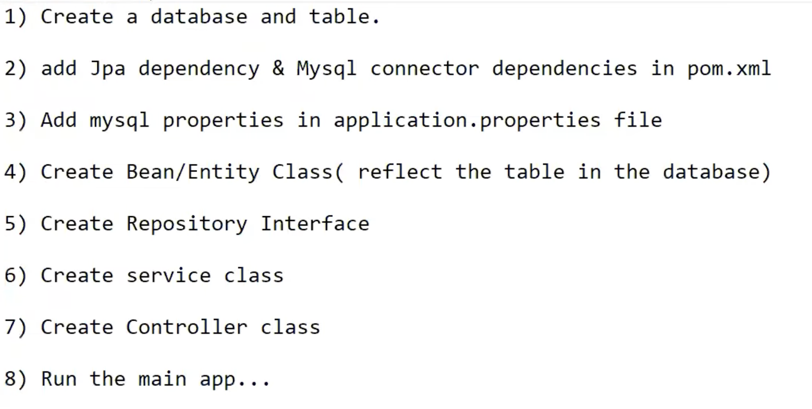

# Spring-Boot-Project

[SpringBootCountryServiceProject](SpringBootCountryServiceProject)

- This project have REST service implementation with HASHMAP(Without DB).

### How to use ?

Directly `Run` the application using `Run as Spring Boot app`.

*No additional configuration needed to run this application.*

[SpringBootCountryServiceProject-JPA](SpringBootCountryServiceProject-JPA)

- This project have REST service implementation with Database(MySQL DB).

### How to use ?

